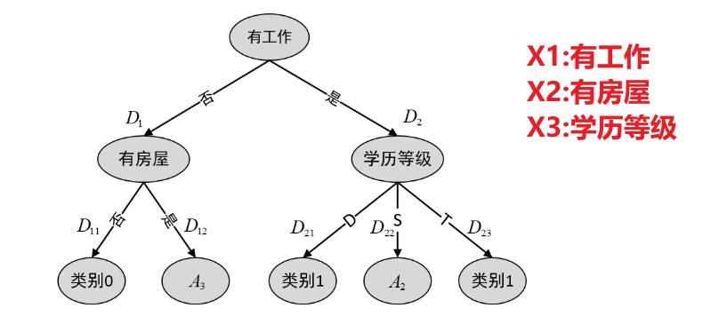

# 决策树原理
决策树是一种分类算法。它的基本思想是模拟人进行理性判断的过程，即通过不断地问自己问题来得出一个问题的最终答案。每一次问问题都能降低信息的不确定性，当问到最后的信息是确定的时候，就可以停止了。（决策树的终止条件）
当问的问题能最大程度降低信息的不确定性，那么此时问这个问题就是最好的。（决策树的构建）
上面的算法中存在的疑惑是如何衡量信息的不确定性。有两种方法：

1. 使用香农提出的信息熵
2. 使用基尼系数

ID3和C4.5算法使用的是信息熵，CART算法使用的是基尼系数。

## ID3算法

### 数学公式
**信息熵的计算公式**：$H(X)=-\sum_{i=1}^nP_ilog_2P_i$
当一个问题的不确定性越高时，对应的信息熵就越大。以**二分类**为例，绘制信息熵与概率的函数图像，并尝试说明这一点。

```python
def entropy(p):
  # 传入特征取第一个值的概率p，则取另一个值的概率为1-p
  return (-p * np.log(p)/np.log(2) - (1-p) * np.log(1-p)/np.log(2))

x = np.linspace(0.01, 0.99, 200)
plt.plot(x, entropy(x))
plt.show()
```

从图中可以看到，当p=0.5时信息熵取得最值，因为这时信息是最不确定的。当信息完全确定，即p=0或1时，信息熵=0，为最小值。

衡量问一个问题前后信息不确定性降低了对少，就是计算问这个问题前后信息熵的差值，即**信息增益**。问问题后的信息熵称为**条件熵**。
**条件熵的计算公式**：$H(X|Y)=-\sum_{i=1}^nP_iH(X|Y=y_i)$
**信息增益的计算公式**：$gain(X,Y)=H(X)-H(X|Y)$，即信息熵减去条件熵。

### 例题

题目中有三个特征X，标签为Y，15个样本。X1、X2有两个取值，X3有三个取值。
总的信息熵：$H(D)=-(\frac{10}{15}log_2\frac{10}{15}+\frac{5}{15}log_2\frac{5}{15})≈0.918$
问特征1的条件熵：$H(D|X1)=-\frac{7}{15}(\frac{4}{7}log_2\frac{4}{7}+\frac{3}{7}log_2\frac{3}{7})-\frac{8}{15}(\frac{7}{8}log_2\frac{7}{8}+\frac{1}{8}log_2\frac{1}{8})m≈0.75$
对应的信息增益：$gain(D,X1)=0.918-075=0.168$
同理计算特征2和特征3的条件熵和信息增益：
特征2：$H(D|X2)=0.81$，$gain(D,X2)=0.108$
特征3：$H(D|X3)=0.91$，$gain(D,X3)=0.008$
选择信息增益最大的特征作为根结点，即X1。

编写程序来模拟上面计算中选择信息增益最大的特征的过程：
```python
import numpy as np
from math import log2
from collections import Counter

# 传入特征取第一个值的概率p，则取另一个值的概率为1-p
def entropy(y):
  counter = Counter(y) # 统计标签中每个值出现的次数
  res = 0.0
  for num in counter.values():
    p = num/len(y)
    res += -p * log2(p)
  return res

def split_by_val(X_i, y):
  counter = Counter(X_i)  # 一个特征可能有多个取值
  groups = []  # 返回一个字典列表
  print(X_i)
  print(y)
  for val in counter.keys():
    indexs = X_i[:] == val
    x_i = X_i[indexs]
    y_i = y[indexs]
    groups.append({'value': val, 'num': counter[val], 'y': y_i, 'indexs': indexs})
  return groups

def try_split(X, y):
  all_entropy = entropy(y)  # 先计算总的信息熵
  flag = -1  # 代表最终选用的特征的编号
  inc_entropy = 0
  fin_groups = []
  for i in range(len(X[0])):  # 依次计算各个特征的条件熵
    con_entropy = 0
    groups = split_by_val(X[:, i], y)
    # print(groups)
    for group in groups:  # 计算条件熵的公式
      con_entropy += group['num']/len(y) * entropy(group['y'])
    temp = all_entropy - con_entropy
    print(f"计算得到的条件增益为{temp}")
    if temp > inc_entropy:
      inc_entropy = temp
      fin_groups = groups
      flag = i
  
  return flag, fin_groups
      
X = np.array([[0, 1, 'T'], [0, 1, 'S'], [0, 1, 'S'], [0, 0, 'T'], [0, 1, 'T'],
     [0, 0, 'T'], [0, 0, 'D'], [1, 0, 'T'], [1, 0, 'T'], [1, 0, 'D'], 
     [1, 1, 'D'], [1, 1, 'T'], [1, 1, 'T'], [1, 0, 'S'], [1, 0, 'S']])
y = np.array([1, 1, 1, 0, 0, 0, 0, 1, 1, 1, 1, 1, 1, 0, 1])
flag, groups = try_split(X, y)
print(f"选择特征X{flag}作为根结点\n")
```
输出：
```
['0' '0' '0' '0' '0' '0' '0' '1' '1' '1' '1' '1' '1' '1' '1']
[1 1 1 0 0 0 0 1 1 1 1 1 1 0 1]
计算得到的条件增益为0.168621667532054
['1' '1' '1' '0' '1' '0' '0' '0' '0' '0' '1' '1' '1' '0' '0']
[1 1 1 0 0 0 0 1 1 1 1 1 1 0 1]
计算得到的条件增益为0.10884853738273681
['T' 'S' 'S' 'T' 'T' 'T' 'D' 'T' 'T' 'D' 'D' 'T' 'T' 'S' 'S']
[1 1 1 0 0 0 0 1 1 1 1 1 1 0 1]
计算得到的条件增益为0.009264365827841625
选择特征X0作为根结点
```
和之前计算的结果一致（有小数保留时产生的误差，可忽略）。

> 现在仅仅计算得到了决策树的根结点，其他结点的计算同理。

尝试在上面代码的基础上，计算第二层结点选择的特征：
```python
# 第二次划分
col = list(range(0, flag)) + list(range(flag+1, len(X[0])))
for group in groups:
  flag2, temp = try_split(X.take(col, 1)[group['indexs']], group['y'])
  if(flag2>=flag): flag2 += 1
  print(f"特征X{flag}取值为{group['value']}时，选择特征X{flag2}\n")
```
```
['1' '1' '1' '0' '1' '0' '0']
[1 1 1 0 0 0 0]
计算得到的条件增益为0.5216406363433186
['T' 'S' 'S' 'T' 'T' 'T' 'D']
[1 1 1 0 0 0 0]
计算得到的条件增益为0.5216406363433186
特征X0取值为0时，选择特征X1

['0' '0' '0' '1' '1' '1' '0' '0']
[1 1 1 1 1 1 0 1]
计算得到的条件增益为0.09235938389499498
['T' 'T' 'D' 'D' 'T' 'T' 'S' 'S']
[1 1 1 1 1 1 0 1]
计算得到的条件增益为0.2935644431995964
特征X0取值为1时，选择特征X2
```
生成的决策树如下：


接下来给出ID3算法的步骤。

### 算法
输入：训练数据集D，特征集A，阈值$\epsilon$;

输出：决策树。
(1) 若D中所有样本属于同一类（即此时只有一个类别），则T为单节点树，将作为该节点的类标记，返回T;【固有终止条件】
(2) 若A为空，则T为单节点树，并将中样本数最多的类作为该节点的类标记，并返回T；【固有终止条件】
(3) 否则，计算A中各特征对D的信息增益，**选择信息增益最大的特征$A_g$**；
(4) 如果的**信息增益小于阈值**，则置T为单节点树，并将中样本数最多的类作为该节点的类标记，返回T；【外部终止条件】
(5) 否则，对$A_g$的每一个可能值$a_i$，将D分割为若干非空子集$D_i$，并建立为子节点；
(6) 对于第`i`个子节点，以$D_i$为训练集，以为$A-{A_g}$特征集，**递归地调用(1)-(5)**，得到子树，返回。

ID3算法可以使用`sklearn`中的`DecisionTreeClassifier`来实现。

先来看这个类的构造函数：

```python
def __init__(self, *,
            criterion="gini",
            splitter="best",
            max_depth=None,
            min_samples_split=2,
            min_samples_leaf=1,
            max_features=None,
            min_impurity_split=None): 
```
1. `criterion`用来选择划分时信息不确定性的度量标准，ID3算法应该传入`entropy`，表示使用信息熵。
2. `min_samples_split`是分割所需的最小样本数，如果一个结点上的样本数小于该值，就不再继续划分。
3. `min_samples_leaf`是叶节点所需的最小样本数，如果能划分但是划分后有一个结点的样本数小于该值，就不划分。
4. `min_impurity_split`就是信息增益的阈值$\epsilon$。